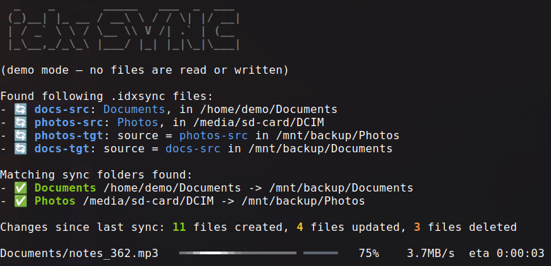

# idx-sync



A fast, safe, one-way folder **synchronization / backup** CLI, written in idiomatic Kotlin.

`idx-sync` auto-detects synchronizable folder pairs across your mounted drives (USB sticks, external
disks, …), figures out what changed, and mirrors a **source** folder onto its **target** — with a modern,
full-width console UI and strong data-safety guarantees.

This is a ground-up rewrite of an earlier Java tool, focused on: idiomatic Kotlin, a clean SOLID
architecture, an excellent cross-platform console UI, crash-safe copying, real backup safety, and thorough
tests.

## Highlights

- **Beautiful, modern console output** (powered by [Mordant](https://github.com/ajalt/mordant)) — full-width
  progress bars with an **accurate ETA**, live spinners, colors, and a clean summary. Renders identically on
  Linux, macOS and Windows, and degrades gracefully to plain text where ANSI isn't available.
- **Crash-safe copying** — a file is written to a hidden temp file in the same directory, then atomically
  swapped into place (old → backup → replace → drop backup). Aborting mid-copy never corrupts or loses the
  existing target.
- **Backup-safe** — a 0-byte, missing, unreadable or non-regular source is **skipped and reported**, never
  written over a good target.
- **Restore mode** — reverse a sync to recover files at the source; restore **never deletes**.
- **Smart excludes** — per-folder `exclude-patterns` plus a built-in always-exclude set of platform
  system/junk files (Windows, macOS, Linux), regenerable developer artifacts (`node_modules`, `.git`,
  `.svn`, …) and idx-sync's own control files.
- **Demo mode** — simulate a whole run to admire (or test) the UI, without touching any files.

## Usage

```bash
idx-sync                       # no arguments: print usage
idx-sync scan                  # find markers and list matching sync pairs
idx-sync diff [source]         # show pending changes (all pairs, or only the source matching <source>) without applying them
idx-sync sync [source]         # synchronize all pairs, or only the source matching <source> (folder-id, name or path)
idx-sync sync <source> --verify # ...and hash-check every copied file against the source before replacing the target
idx-sync source <path> [name]  # mark a folder as a synchronization source (name defaults to the folder's name; required for a filesystem root)
idx-sync target <path> <id>    # mark a folder as a target mirroring source <id>
idx-sync pair <source> <target> # set up a source and a target mirroring it, in one step
idx-sync remove <path>         # remove a folder's .idxsync marker
idx-sync restore <source> [sub-path]  # restore a source folder (by id, name or path) from its target — optionally only under <sub-path>
idx-sync version               # print the version (also: --version)
idx-sync demo 15s              # simulate a run for 15s to showcase the UI
```

Global option `--ascii` (or the `NO_UNICODE` env var) switches to plain-ASCII icons and progress bars for
legacy terminals. `sync`/`restore` exit non-zero when a run fails, so they compose in scripts.

**The source is treated as strictly read-only during a sync** — files there are never written, moved or
deleted (only read). A hard safety net refuses any write/delete that would land inside a source folder.
`restore` is the only mode that writes to a source, and even then it only creates/updates — it never
deletes. It requires a source-folder-id, shows the differences, and asks for confirmation before writing.

Scanning is a quick, shallow sweep of the filesystem roots and the current directory (down to a bounded
depth), with a progress bar that clears when done — it then lists the discovered markers and the matching
pairs. The copy phase shows a wide, byte-accurate progress bar that is replaced by a summary report
(created / updated / deleted / elapsed) when it finishes.

`diff` reports its results **grouped per folder pair**: for each pair it prints the pair's name and its
source / target directories, followed by that pair's changes since the last sync. Like `sync` and
`restore`, it accepts an optional source **selector** (folder-id, folder name, source path or target path)
to restrict the report to the matching pair(s); with no selector it reports every pair.

### Marking folders

A folder takes part in synchronization when it contains a hidden **`.idxsync`** marker (YAML). Create them
with the `source` / `target` commands.

A **source** marker:

```yaml
folder-id: 4ec2840b-e80b-4498-a2cd-820f283ba2e0
folder-name: My Documents
exclude-patterns:
  - node_modules
  - .git
  - build
include-hidden: true
```

A **target** marker just points at the source it mirrors:

```yaml
folder-id: b50ada47-aa1d-4b30-9a9d-6ed723e10550
source-folder-id: 4ec2840b-e80b-4498-a2cd-820f283ba2e0
```

The marker format is backward-compatible with the original tool.

`pair <source> <target>` does both sides in one step: it sets up the source folder as a source (reusing it
if it already is one, keeping its existing folder-id) and creates or updates the target folder's marker to
mirror that source. A newly-created source gets its folder name from the directory name and the default
excludes; an existing source is left untouched.

### Exclude patterns

- A **slash-less** pattern (`node_modules`, `*.tmp`) matches that name at **any depth**, including the
  source root (gitignore-like).
- A pattern containing `/` or `**` uses **ant** matching against the path relative to the root
  (`build/**`, `**/*.log`). Note `**/x` matches `x` only at depth ≥ 1.
- Platform junk (see below) is **always** excluded, on every platform, regardless of your patterns.

### Built-in platform excludes

These system/junk files are always excluded so they never end up in a backup. They are **not** hard-coded —
they live in the internal resource [`platform-excludes.yaml`](src/main/resources/platform-excludes.yaml) and
are matched per file/directory name, case-insensitively (excluding a directory prunes its whole subtree).

| Group | Always-excluded names |
|-------|-----------------------|
| **idx-sync** (all platforms) | `.idxsync`, and its in-flight temp/backup files `*.idxtmp`, `*.idxbak`, `.*.idxtmp`, `.*.idxbak` |
| **editors-and-temp** | `*.bak` |
| **development** | `node_modules`, `__pycache__`, `.git`, `.svn`, `.hg`, `CVS` |
| **Windows** | `Thumbs.db`, `ehthumbs.db`, `ehthumbs_vista.db`, `desktop.ini`, `pagefile.sys`, `hiberfil.sys`, `swapfile.sys`, `$RECYCLE.BIN`, `RECYCLER`, `System Volume Information`, `MSOCache`, `$Windows.~BT`, `$Windows.~WS` |
| **macOS** | `.DS_Store`, `._*` (AppleDouble resource forks), `.AppleDouble`, `.LSOverride`, `.DocumentRevisions-V100`, `.fseventsd`, `.Spotlight-V100`, `.TemporaryItems`, `.Trashes`, `.VolumeIcon.icns`, `.com.apple.timemachine.donotpresent`, `.AppleDB`, `.AppleDesktop`, `.apdisk`, `Network Trash Folder`, `Temporary Items` |
| **Linux** | `.directory`, `lost+found`, `.Trash-*`, `.nfs*`, `.fuse_hidden*` |

The **development** group holds regenerable developer artifacts and version-control metadata that don't
belong in a backup. Excluding a directory prunes its whole subtree, so a huge `node_modules` or `.git`
folder is skipped entirely — which also keeps scans fast. Note this is a deliberate trade-off for a *backup*
tool: excluding `.git` / `.svn` / `.hg` means a sync does **not** preserve repository history. If you need a
repo's history mirrored, back up a bundle/dump of it instead. Names with real-file false positives (e.g.
`build`, `dist`, `target`) are intentionally **not** here — put those in a folder's own `exclude-patterns`.

To add or change one, edit `platform-excludes.yaml` — no code change needed.

## How a sync decides changes

For each file relative to the pair's roots:

- present in source only → **create**
- present in both but size differs, or last-modified differs by more than 2s → **update**
  (2s tolerates FAT/exFAT's 2-second mtime resolution, common on the USB media this tool targets)
- present in target only → **delete** (mirror; never in restore mode)

Copies preserve the source's last-modified time.

## Build

Requires a JDK (targets JDK 17+; the toolchain here runs on JDK 25).

```bash
./gradlew build              # compile + run tests
./gradlew installDist        # build a runnable install under build/install/idx-sync
./gradlew shadowJar          # build a self-contained executable jar (build/libs/idx-sync.jar)
```

Run the fat jar directly:

```bash
java -jar build/libs/idx-sync.jar demo 10s
```

## Shell function snippet

Build and copy to your home folder:

```bash
./gradlew && cp build/libs/idx-sync.jar ~ 
```

Then you can define the following shell function to run it from anywhere with `idxsync`:

```bash
function idxsync() {
  java -jar ~/idx-sync.jar "$@"
}
```

## Architecture

Clean separation of concerns:

| Package  | Responsibility |
|----------|----------------|
| `core`   | Pure domain model (`SyncMode`, `SyncAction`, `FileChange`, `SyncPair`, `SyncResult`) |
| `config` | The `.idxsync` marker model + repository (read/write YAML) |
| `filter` | Ant path matching, platform excludes, the effective exclude filter |
| `scan`   | File-tree walking, marker scanning, source↔target pair resolution |
| `diff`   | Change detection between two trees |
| `sync`   | Crash-safe atomic writer + the safety-guarded synchronizer |
| `ui`     | The Mordant console front-end and formatting |
| `cli`    | Clikt command tree, orchestration, demo runner |
